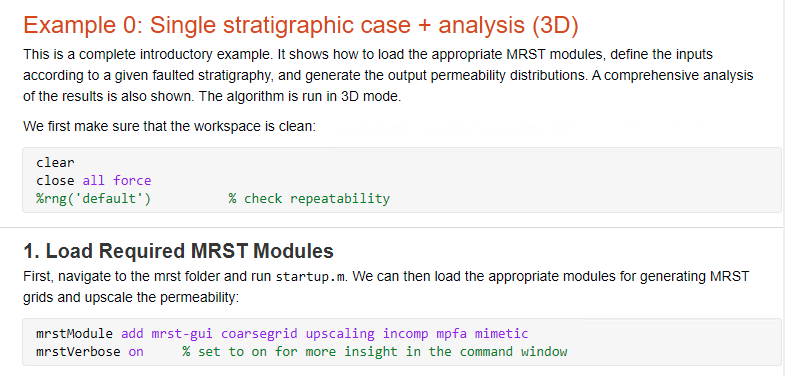
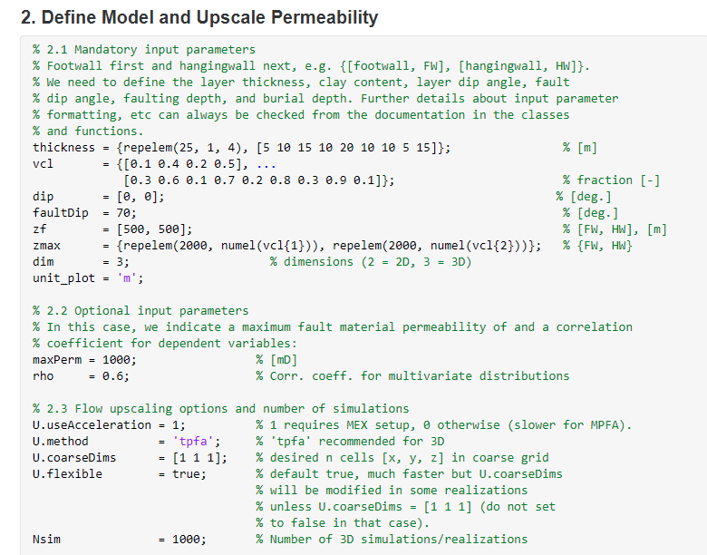
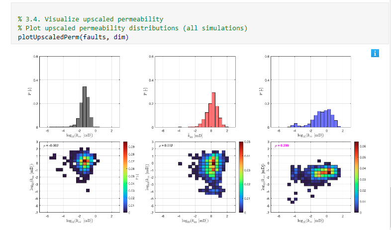

<h1 align="center">
  <a href="https://github.mit.edu/lsalo/predict"></a>
</h1>

<h4 align="center">
    PREDICT: PeRmEability DIstributions of Clay-smeared faulTs
</h4>

<p align="center">
    <a href="https://www.mathworks.com/products.html">
        
    </a>
    <a href="https://www.gnu.org/licenses/gpl-3.0">
        
    </a>
    <a href="https://github.com/lsalo/predict/commits/main">
    
    <a href="https://doi.org/10.5281/zenodo.7104886"></a>
</p>

<p align="center">
  <a href="#overview">Overview</a> •
  <a href="#citation">Citation</a> •
  <a href="#requirements">Requirements</a> •
  <a href="#download">Download</a> •
  <a href="#installation">Installation</a> •
  <a href="#examples">Examples</a> •
  <a href="#license">License</a> •
  <a href="#acknowledgements">Acknowledgements</a>
</p>

---
This code was developed as part of my PhD in Prof. Ruben Juanes' lab (<a href="http://juanesgroup.mit.edu">juanesgroup.mit.edu</a>) at MIT Civil and Environmental Engineering. 

**NOTE**: Contributions are welcome, please send me a message first (lsalo@mit.edu).

## Short Description
Computes upscaled fault permeability distributions using a parameter-based, probabilistic description of clay and sand smears. MATLAB and MRST are required to run this code.

## Overview
**PREDICT** is a novel algorithm designed to *predict*, i.e., compute, the diagonal components of the fault permeability tensor (perpendicular to the fault, *k*<sub>xx</sub>; strike-parallel, *k*<sub>yy</sub>; and dip-parallel, *k*<sub>zz</sub>) in relatively shallow siliciclastic sequences (<~3 km of depth). The computation is done for a given throw interval, and the material distributions and output permeability values are representative of the main shear zone within a faulted sediment volume. Hence, **PREDICT** represents an architectural domain typically referred to as the fault core (see figures below). PREDICT can be run in two modes: 2D and 3D.

**2D workflow**
1. The algorithm takes a set of numerical quantities, the input parameters, that describe the faulted stratigraphy.
2. **PREDICT** generates marginal probability distributions, according to the input parameters, for another set of numerical quantities; these are intermediate random variables required to compute the dimensions, distribution and permeability of the clay- and sand-smears. Samples are drawn accounting for variable dependency.
3. Object-based simulation is used to place the clay-smears within the fault (a fault cross section with x-z dimensions). The sand smears are placed next, according to the amount and location of the space available.
4. The equivalent or upscaled fault permeability computation for the modeled throw interval is based on the material distribution within the fault, and uses flow-based upscaling for *k*<sub>xx</sub> and *k*<sub>zz</sub>, while area-weighted arithmetic average is used for *k*<sub>yy</sub>.

Steps two to four are repeated multiple times, each one representing one realization or simulation, until the full permeability distribution for each component is obtained (see figure below). As shown below, the 2D version is significantly faster and less memory-intensive, but leads to lower permeabilities and cannot accurately model *k*<sub>yy</sub>.


**3D workflow**

Steps one to three are identical to the 2D version (described above).

4. Multiple fault cross sections are constructed in the same way (i.e., following steps two-three). The number of cross sections is equal to *s*<sub>s</sub>, and all of them are assigned the same fault thickness. This represents the inner loop in the workflow figure below.
5. A 3D fault volume is assembled by concatenating n=*s*<sub>s</sub> sections from point 4 above. Flow-based upscaling is used for all three fault permeability components. Additionally, in the 3D version the user can specify a coarse grid for upscaling with multiple cells in either of the three dimensions, which is useful for subsequent reservoir simulation in faulted settings.

Similar to the 2D version, steps two to five are repeated multiple times, each iteration representing one realization or simulation, until the full permeability distribution for each component is obtained.


## Citation
The full description of PREDICT is provided in the paper (and, in particular, the supplement) below.

**Paper**
```
@article{salo22faultPaper,
  title={Fault permeability from stochastic modeling of clay smears},
  author={Llu{\'i}s Sal{\'o}-Salgado and Davis, J Steven and Juanes, Ruben},
  year={2023},
  journal={Geology},
  volume={51},
  number={1},
  publisher={Geological Society of America},
  doi={10.1130/G50739.1}
}
```
```
@article{salo22faultSupplement,
  title={Supplemental Material: Fault permeability from stochastic modeling of clay smears},
  author={Llu{\'i}s Sal{\'o}-Salgado and Davis, J Steven and Juanes, Ruben},
  year={2022},
  url={https://gsapubs.figshare.com/articles/journal_contribution/Supplemental_Material_Fault_permeability_from_stochastic_modeling_of_clay_smears/21397161},
  doi={10.1130/GEOL.S.21397161.v1}
}
```

**Code**
```
@software{salo22faultCode,
  author = {Llu{\'i}s Sal{\'o}-Salgado and Davis, J Steven and Juanes, Ruben},
  doi = {10.5281/zenodo.7104886},
  title = {{PREDICT}},
  url = {https://github.com/lsalo/predict},
  version = {1.0.0},
  month = {09},
  year = {2022}
}
```
If PREDICT is useful for your research, please cite it where appropriate.

## Requirements
**Hardware**: When running thousands of simulations, a machine with multiple cores (4+) and few GB of RAM (6-8+) is recommended (2D version). For the 3D version, we recommend a machine with a minimum of 16GB RAM, given that some of the structures will be heavy, but it is possible to run the code with a 8GB RAM laptop. Running times are provided below for 1000 realizations in a given stratigraphy:

<p style="text-align:center;"></p>

**Software**:
PREDICT can be run on Windows, macOS and Linux (i.e. any OS where <a href="https://www.mathworks.com/products/matlab.html">MATLAB</a> can be installed). The code incorporates <a href="https://www.sintef.no/mrst/">MRST</a> functionality for flow-based permeability upscaling, so it requires an installation of both MATLAB and MRST (very straightforward, see steps below). Development took place using <a href="https://www.mathworks.com/company/newsroom/mathworks-introduces-release-2020b-of-matlab-and-simulink.html">MATLAB r2020b</a> and the development version of MRST. The code has also been tested with MATLAB r2020a and r2021a, as well as the current MRST public release (<a href="https://www.sintef.no/projectweb/mrst/download/">v2021a</a>). Backward compatibility with previous MATLAB versions also supported by MRST 2021a is likely, but it has not been tested.

In addition, PREDICT uses the following MATLAB add-on toolboxes:

* <a href="https://www.mathworks.com/products/statistics.html">Statistics and Machine Learning Toolbox</a> (**required**): For generating intermediate variable distributions and samples.
* <a href="https://www.mathworks.com/products/parallel-computing.html">Parallel Computing Toolbox</a> (*recommended*): Not required, but *highly* recommended for anyone using the code beyond exploration purposes. Time gains when running parallel simulations are illustrated above for 1000 realizations/simulations of a given stratigraphic case.
* <a href="https://www.mathworks.com/products/curvefitting.html">Curve Fitting Toolbox</a> (*recommended*): Not required, but may be useful for output analysis.

## Download
* **MATLAB**: Can be installed following the instructions <a href="https://www.mathworks.com/products/get-matlab.html?s_tid=gn_getml">on the website</a>, and your academic institution likely provides campus-wide access free of charge.
* **MRST**: The latest public release of MRST can be downloaded <a href="https://www.sintef.no/projectweb/mrst/download/">here</a>.
* **PREDICT**: This repository can be cloned or downloaded from <a href="https://github.com/lsalo/predict">the top of the page</a> (green button "code"). 

## Installation
We show installation steps for both MRST and PREDICT.

1. Download the latest MRST release (see above).
2. Download PREDICT (see above).
3. From within MATLAB, run the `startup.m` file in the main MRST folder. You will be prompted whether you want to enable MEX acceleration, select enable. This can be changed later by running the command `mrstSettings()`.
4. From within MATLAB, right click on the `predict` folder and select "Add to Path > Selected Folders and Subfolders".

You can now run PREDICT (see Examples section below). Note that, for flow-based permeability upscaling, both a TPFA and a MPFA can be used in the 2D version. If you are running PREDICT without MEX, TPFA is recommended (otherwise, it will be slow). 

## Examples
Examples are provided in the folder <a href="https://github.mit.edu/lsalo/predict/tree/master/examples">examples</a>. For a comprehensive introductory example, run `example0_singleStrati.m` or, in the live editor, `example0_singleStrati_live.mlx` (2D). Similar files are provided for the 3D version:




...




## License
PREDICT incorporates MRST functionality, so it legally becomes an extension of MRST. Therefore, it is also released under the terms of the GPL license.

## Acknowledgements
This work was funded by **ExxonMobil** through the project *"Modeling and Mitigation of Induced Seismicity and Fault Leakage during CO<sub>2</sub>  storage"*. L.S. and R.J. greatly appreciate the numerous, productive discussions with the ExxonMobil team participating in the project. We also thank ExxonMobil for permission to publish this code.
    
L.S. would like to acknowledge **The MathWorks, Inc.** and the **School of Engineering at MIT** for funding through a 2020-2021 *MathWorks Engineering Fellowship*.
    
The authors would also like to thank Youssef Marzouk and Ehsan Haghighat for their helpful comments on multivariate statistical modeling, as well as Olav Møyner and the MRST development team for outstanding support.

Readme design based on examples from <a href="https://github.com/matiassingers/awesome-readme">Awesome README</a>.